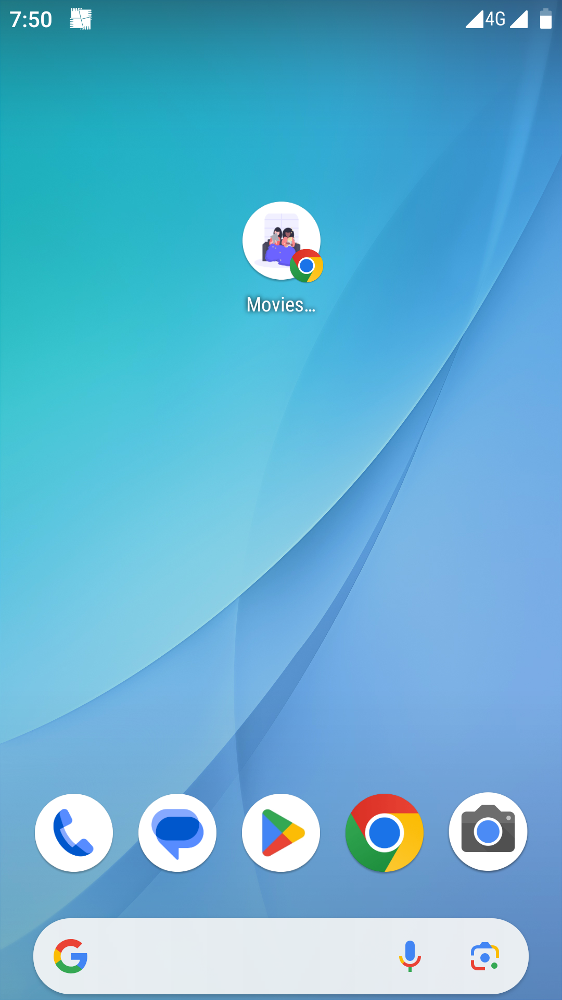
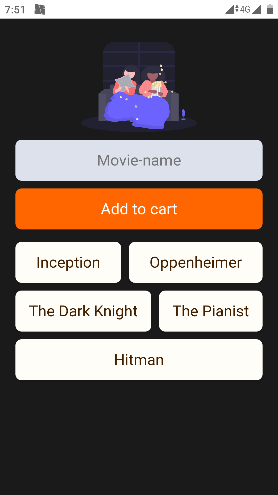

# Movies List App

This is a simple mobile app built using HTML, CSS, JavaScript, and Firebase Realtime Database. The app allows users to create a list of movies they want to watch and mark them as watched.

  
  

## Features

- Add movies to the list
- Delete movies from the list by clicking on them (marking them as watched)

## Technologies Used

- HTML
- CSS
- JavaScript
- Firebase Realtime Database

## Live Preview

You can view a live preview of the app [here](https://movies-app-firebase.netlify.app/).

## License

Distributed under the MIT License. See [`LICENSE`](LICENSE) for more information.

